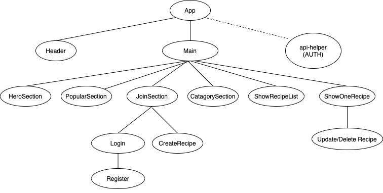

# theRecipeBox

## Table of Contents

- [Overview](#overview)
  - [Project Team](#project-team)
  - [Project Description](#project-description)
  - [Core Features](#core-features)
- [Design](#design)
  - [Client](#client)
    - [Wireframes](#wireframes)
    - [Client Directory](#client-directory)
    - [Component Heirarchy](#component-heirarchy)
    - [Component Breakdown](#component-breakdown)
  - [Server](#client)
    - [ERD Model](#erd-model)
    - [Data Heirarchy](#data-heirarchy)
    - [API Endpoints](#api-endpoints)
    - [Dependencies](#dependencies)
- [Post MVP](#post-mvp)

# Overview

## Project Team

Created, designed, and developed by [Kay Chan](https://github.com/kaych26)

## Project Description

theRecipeBox is a digtial portal for individuals to upload and share their favorite recipes. During this pandemic time, many are facing challenges on what to cook for their families. This app will allow individuals to connect by sharing their recipes and cooking ideas.

## Core Features

The user can browse through the recipes with or without logging in. To upload a recipe, the user will need to create a user account. The owner of the recipe has the ability to update and delete the recipe.

## Goal

The goal of this app is to allow people to get home style recipes created by other families, not chefs and allowing people with different backgrounds to connect through food.

 
# Design

## Client

Frontend - React
 
Frontend Deployment - Netlify
 

### Wireframe

 

### Client Directory

 

### Component Heirarchy

 

### Component Breakdown

 
| Component | Type | State | Props | Description |
| ------------ | ------------- | ------------ | ------------- | ------------------------------------- |
| Header | functional | N | Y | The header will contain the logo and login button.  The user name will be passed into header via props. |
| Main | class | Y | N | The main will store/track the API recipe data and render the sections. |
| HeroSection | functional | Y | N | The section rendering the hero image. |
| PopularSection | functional | N | N | The section rendering images of the popular recipes. |
| JoinSection | functional | N | Y | The section for user login and register buttons. |
| CatagorySection | functional | N | Y | The section to render the recipe catagories for user to click into. |

## Server

Back End

The Server will be developed using Rails

### ERD Model

### Data Heirarchy

#### API Endpoints:

./Home/
 
./Home/Login
 
./Home/ShowRecipeList
 
./Home/ShowRecipeList/:id
 
./Home/Create
 

### Dependencies

| Library      | Purpose          |
| ------------ | ---------------- |
| React        | Render Front End |
| React Router | Render Front End |
| CORS         | Render Front End |
| Rails        | Back End Server  |

# Post-MVP

Use this section to document ideas you've had that would be fun (or necessary) for your Post-MVP. This will be helpful when you return to your project after graduation!

# Code Showcase

Use this section to include a brief code snippet of functionality that you are proud of and a brief description.

# Code Issues & Resolutions

Use this section to list of all major issues encountered and their resolution, if you'd like.
