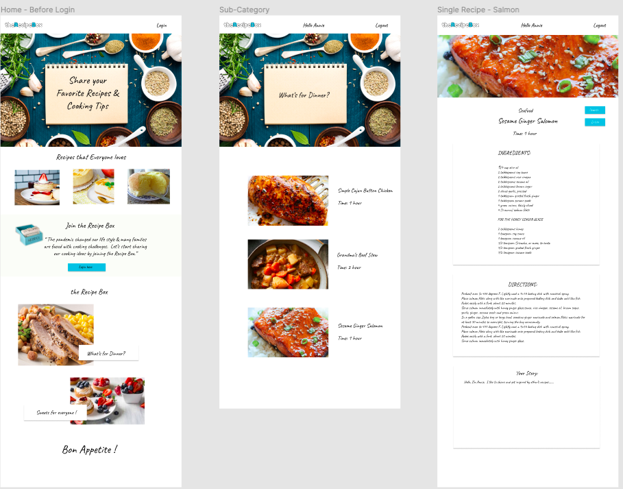
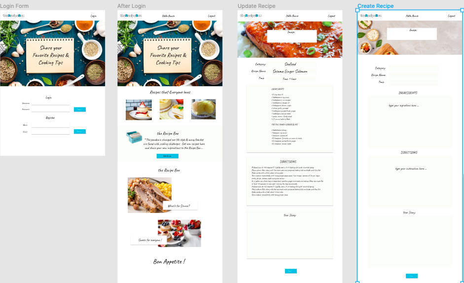
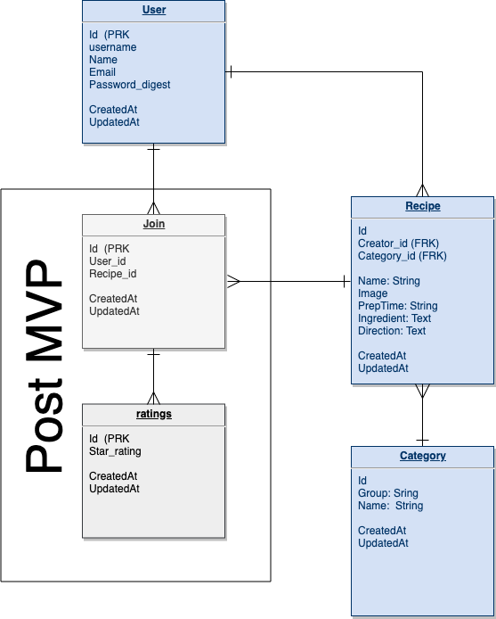

#

## Table of Contents

- [Overview](#overview)
  - [Project Team](#project-team)
  - [Project Description](#project-description)
  - [Core Features](#core-features)
- [Design](#design)
  - [Client](#client)
    - [Wireframes](#wireframes)
    - [Client Directory](#client-directory)
    - [Component Heirarchy](#component-heirarchy)
    - [Component Breakdown](#component-breakdown)
  - [Server](#client)
    - [ERD Model](#erd-model)
    - [Data Heirarchy](#data-heirarchy)
    - [API Endpoints](#api-endpoints)
    - [Dependencies](#dependencies)
- [Post MVP](#post-mvp)

# OVERVIEW

## Project Team

Created, designed, and developed by [Kay Chan](https://github.com/kaych26)

## Project Description

theRecipeBox is a digtial portal for individuals to upload and share their favorite recipes. During this pandemic time, many are facing challenges on what to cook for their families. This app will allow individuals to connect by sharing their recipes and their story.

## Goal

The goal of this app is to allow people to get home style recipes created by other families, not chefs and allowing people with different backgrounds to connect through sharing cooking ideas and stories.

## Core Features

The user can browse through the recipes with or without logging in. To upload a recipe, the user will need to create a user account. The owner of the recipe has the ability to update and delete the recipe.

# DESIGN

## Client

Frontend - React
 
Frontend Deployment - Netlify
 

### Wireframes

 

 

### Client Directory

  

### Component Heirarchy

  

### Component Breakdown

| Component      | Type       | State | Props | Description                                                                                            |
| -------------- | ---------- | ----- | ----- | ------------------------------------------------------------------------------------------------------ |
| Header         | functional | N     | Y     | The header will contain the logo and login button. The user name will be passed into header via props. |
| Main           | class      | Y     | Y     | The main will store/track the API recipe data and render the sections.                                 |
| Hero           | functional | N     | N     | The section rendering the hero image.                                                                  |
| Popular        | functional | N     | Y     | The section rendering images of the popular recipes.                                                   |
| Join           | functional | N     | Y     | The section for user login and register buttons.                                                       |
| ShowCategories | functional | N     | Y     | The section to render the recipe catagories for user to click into.                                    |
| ShowRecipes    | functional | N     | Y     | Render the list of recipes with only image and name                                                    |
| OneRecipe      | functional | N     | Y     | Render one recipe with all details                                                                     |
| SignIn         | class      | Y     | Y     | User login, calling the method passed via props                                                        |
| Register       | class      | Y     | Y     | Create new user, calling the method passed via props                                                   |
| CreateRecipe   | class      | Y     | Y     | Create new recipe                                                                                      |
| UpdateRecipe   | class      | Y     | Y     | Allow user to update the recipe and story                                                              |

## Server

Back End: The Server will be developed using Rails

### ERD Model

### Data Heirarchy

#### API Endpoints:

./Home/
 
./Home/Login
 
./Home/ShowRecipeList
 
./Home/ShowRecipeList/:id
 
./Home/Create
 

### Dependencies

| Library       | Purpose           |
| ------------- | ----------------- |
| React         | Render Front End  |
| React Router  | Link and Route    |
| axios         | API calls         |
| Framer-motion | Smooth transition |
| CORS          | Render Front End  |
| Rails         | Back End Server   |

# POST MVP

## Functions

Check if login user is the owner of the recipe to do update or delete. 
After creating the recipe, should redirect to display the uploaded recipe instead of going back to home. 
Add menu button at header to include about, add, update, faq options  
Add back button feature  
The add recipe form: user to list the ingredient and instruction instead of paragraph.
The add recipe form: allow to update each section instead just having one edit option for whole form
Allow logged in users to give star rating for the recipes. 
The popular recipe section to use the highest rated recipes  
List recipes by the user  
Allow user to bookmark their favorite recipes. 
The search function. 

# Code Showcase

Use this section to include a brief code snippet of functionality that you are proud of and a brief description.

# Code Issues & Resolutions

Use this section to list of all major issues encountered and their resolution, if you'd like.
